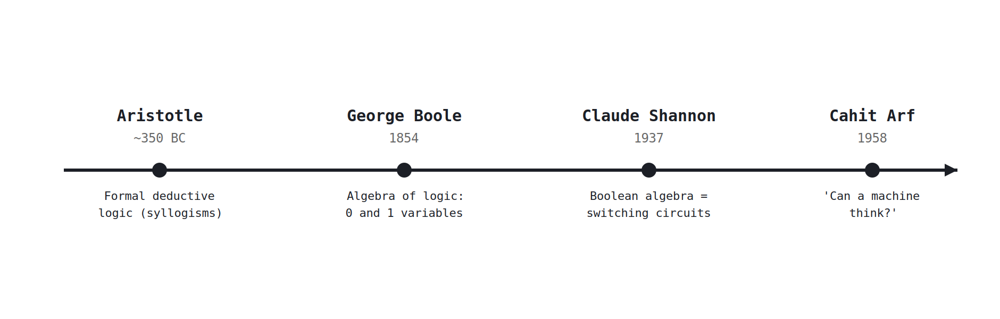

# Week 1: Why logic, and where it came from

[🏠 Home](../) · Next: [Week 2](week02-bits-voltage-adc.html)

> **Goal.** See where logic came from, why it became an algebra, and how that algebra ended up
> running inside a chip. This is the story the whole course retells in hardware.

## From argument, to algebra, to electronics

- **Aristotle** systematised **deductive reasoning**. Against the sophists, who taught how to win
  arguments, he asked what makes an argument **valid** regardless of who makes it, and wrote down
  the rules. That is logic as the structure of correct reasoning.
- **George Boole** turned that verbal logic into an **algebra**. In *The Laws of Thought* (1854)
  a proposition is a variable that is either 1 (true) or 0 (false), and AND, OR, NOT are its
  operations. Reasoning becomes calculation.
- **Claude Shannon** connected the algebra to **electricity**. His 1937 thesis showed that a
  network of switches obeys Boolean algebra exactly, so you can design a circuit by writing an
  expression. This is the moment logic became hardware.
- **Cahit Arf**, the Turkish mathematician, gave a 1958 lecture asking **"Can a machine think?"**
  We include him deliberately: this chain of ideas is not the property of one country or
  tradition. Knowledge is humanity's, and Arf's question is exactly the one a machine built from
  gates makes you ask.

## Why this is the spine of the course

Argument became algebra, algebra became switches, switches became computers. We will walk that
same path from the bottom: start with **gates**, learn the **one method** for designing with
them, and finish by assembling a small **microcontroller** that runs a program. Everything in
between earns its place as a piece of that machine.

## From operators to gates to computers

Boole's three operators are the three basic gates: AND, OR, and NOT, which you meet properly in
[Week 3](week03-boolean-algebra-gates.html). A **gate** is one operator built in silicon; a
handful of gates make an adder; many adders, registers, and a little memory make a computer. The
distance from "true and false" to "a running program" is just a lot of the same simple steps.

## How this course works

**One method:** every circuit comes from a truth table, through minterms, to gates. **One goal:**
a working 4-bit MCU at the end. We favour **depth over coverage**, mastering a few fundamentals
completely rather than skimming many, because a fundamental understood well is something you can
always build on later.

## Check yourself / to discuss

- What separates a **valid** argument from one that is merely **persuasive**? Why did that
  distinction matter to Aristotle?
- Boole wrote his algebra 80 years before any electronic computer. Why was Shannon's 1937 link
  between that algebra and switching circuits such a turning point?
- Arf asked whether a machine can think. After building this course's MCU, how would you answer?
