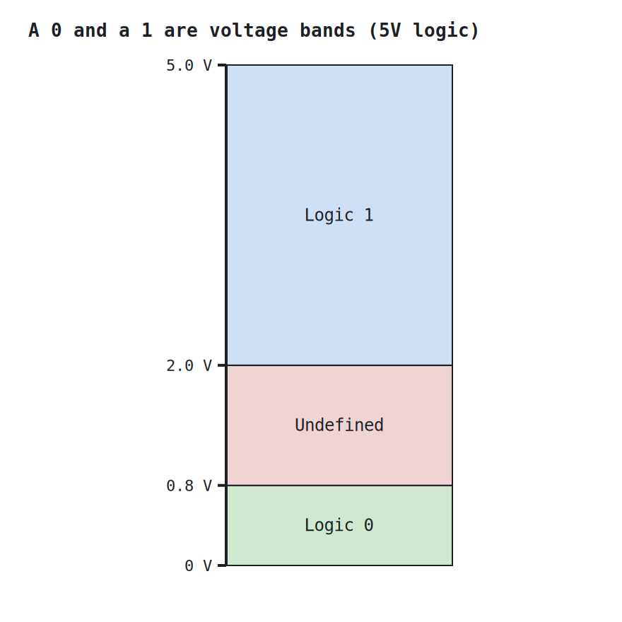
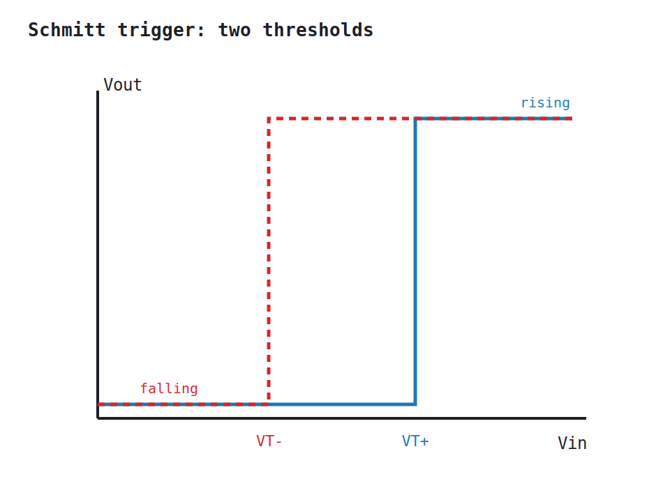
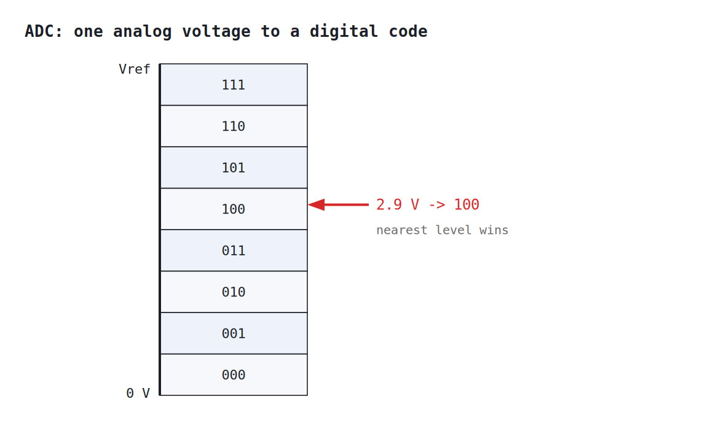

# Week 2: From the real world to bits

[🏠 Home](../) · Prev: [Week 1](week01-why-logic-history.html) · Next: [Week 3](week03-boolean-algebra-gates.html)

> **Goal.** Logic works in 0 and 1, but the real world is decimal and analog. This week bridges
> the two: how we count in binary, what a 0 and a 1 actually are as voltages, and how a continuous
> signal becomes bits.

## Decimal and binary

Decimal uses ten digits and powers of ten; binary uses two digits and powers of two. To read
binary, add the place values where there is a 1: `1101` is `8 + 4 + 0 + 1 = 13`. To write a
decimal number in binary, subtract the largest power of two that fits and repeat, or divide by 2
and read the remainders from bottom to top. Two digits is all the hardware needs, because a wire
is either on or off.

## What a 0 and a 1 really are

A logic 0 is not exactly 0 V and a logic 1 is not exactly 5 V. Each is a **band** of voltages.
Anything below the low threshold counts as 0, anything above the high threshold counts as 1, and
the gap between is **undefined**.

A gate **drives** its output well into the valid band (close to 0 V or close to 5 V) and only has
to **read** an input as being on the correct side of a threshold. The slack between what a gate
outputs and what the next gate needs to see is the **noise margin**, and it is why a little
electrical noise does not corrupt the logic.

## Cleaning a noisy edge: the Schmitt trigger

A slow or noisy signal crossing a **single** threshold wobbles across it many times, and the gate
chatters. A **Schmitt trigger** fixes this with **two** thresholds: once the output switches, the
input must travel all the way to the *other* threshold before it switches back. That gap is
**hysteresis**, and it turns a messy, slow input into one clean edge.

## From analog to digital: the ADC

Most real signals, a temperature, a microphone, a light sensor, are **continuous** voltages.
An **analog-to-digital converter** maps that voltage to the **nearest** of `2^n` levels and
outputs the n-bit code for it. More bits means finer steps and more faithful numbers.

A 3-bit ADC over 0 to 5 V has 8 levels, so each step is about 0.6 V; a 10-bit ADC has 1024 levels
and steps of about 5 mV. This is how the analog world enters a logic circuit as bits.

## Try it yourself (optional)

The Arduino reads a continuous voltage with `analogRead` and a logic level with `digitalRead`,
which is exactly the ADC and the voltage-band ideas on the bench. The wiring and code are in the
[Lab Annex](../annex-lab-arduino.html).

## Check yourself

- Convert 25 to binary, and convert `10110` back to decimal.
- Why must there be an undefined band between logic 0 and logic 1, rather than one sharp
  threshold?
- A 3-bit ADC over 0 to 5 V receives 3.2 V. Which code does it output?
