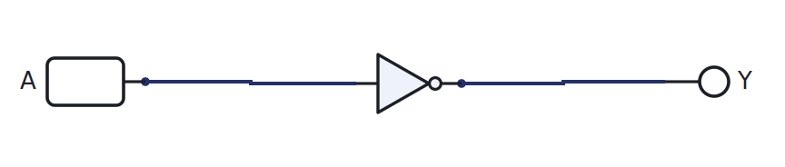
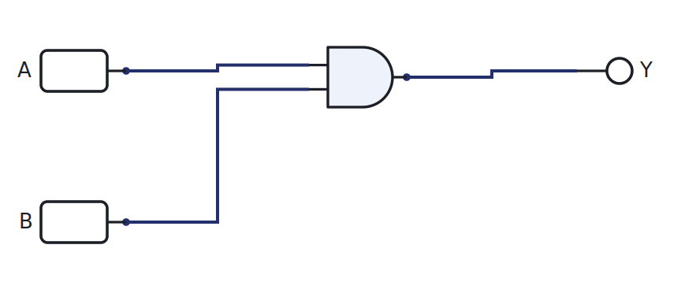
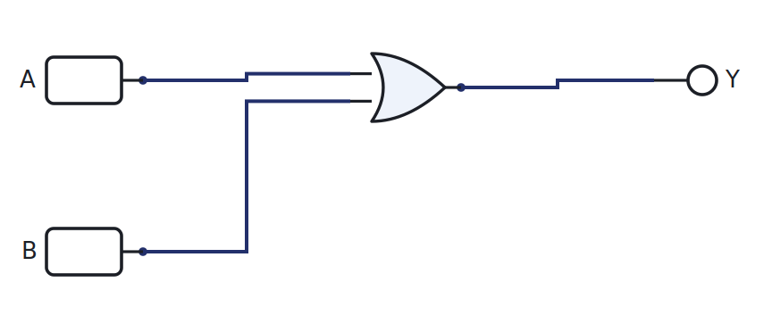
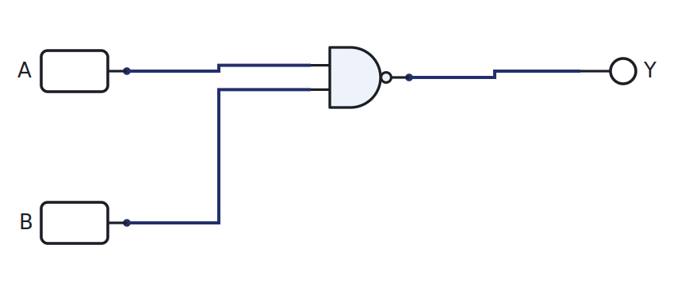
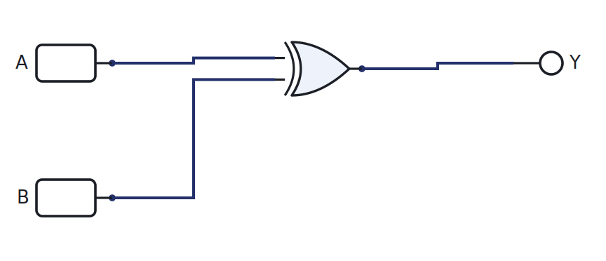
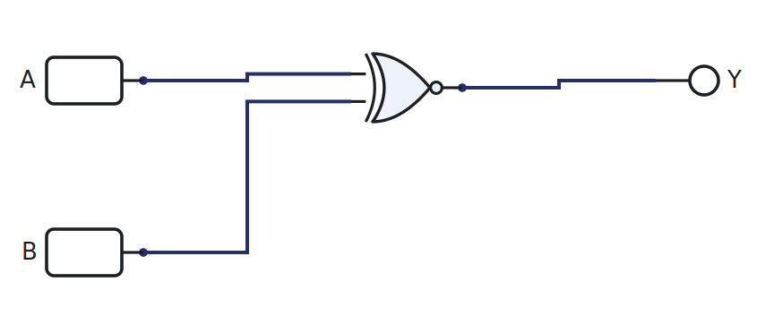

# Week 3: Boolean algebra and the eight gates

[🏠 Home](../) · Prev: [Week 2](week02-bits-voltage-adc.html) · Next: [Week 4](week04-design-chain-minterms.html)

> **Goal.** Meet the gates you build everything from, and the small amount of Boolean algebra
> you need to describe them. We stay practical: the algebra is here to talk about circuits, not
> to grind through proofs.

## An algebra of 0 and 1

A Boolean variable takes only two values, **0** and **1**. Claude Shannon showed in 1937 that a
switching circuit obeys the same algebra, which is why we can design hardware by writing
expressions. Every gate below is one operation in that algebra.

## Huntington postulates (read once, then move on)

Boolean algebra rests on a short list of postulates: closure, an identity for each operation
(0 for OR, 1 for AND), commutativity, distributivity, and a complement for every variable. We
list them so you can **read Shannon's paper**, where they do the heavy lifting. We will **not**
use them to minimise circuits; that job belongs to Karnaugh maps in [Week 5](week05-karnaugh-maps.html).

## The theorems you actually use

A handful come up constantly: `A + 0 = A`, `A · 1 = A`, `A + A' = 1`, `A · A' = 0`, double
negation `(A')' = A`, and above all **DeMorgan**: `(A · B)' = A' + B'` and `(A + B)' = A' · B'`.
DeMorgan is what lets you turn any circuit into NANDs or NORs only.

## Operator precedence

NOT binds tightest, then AND, then OR. So `A + B · C` means `A + (B · C)`. Use parentheses when
in doubt.

## The eight gates

Each gate below is drawn in LogicLab, with its expression and truth table. Click **Open in
LogicLab** to load the live circuit, then toggle **A** and **B** and watch **Y**.

### NOT (inverter)

`Y = A'` — Inverts: output is the opposite of the input.

| A | Y |
|---|---|
| 0 | 1 |
| 1 | 0 |

[▶ Open in LogicLab](https://senolgulgonul.github.io/logiclab/?circuit=https%3A%2F%2Fsenolgulgonul.github.io%2Flogic%2Fexamples%2Fw03-gate-not.logiclab.json)

### AND

`Y = A · B` — Output is 1 only when both inputs are 1.

| A | B | Y |
|---|---|---|
| 0 | 0 | 0 |
| 0 | 1 | 0 |
| 1 | 0 | 0 |
| 1 | 1 | 1 |

[▶ Open in LogicLab](https://senolgulgonul.github.io/logiclab/?circuit=https%3A%2F%2Fsenolgulgonul.github.io%2Flogic%2Fexamples%2Fw03-gate-and.logiclab.json)

### OR

`Y = A + B` — Output is 1 when at least one input is 1.

| A | B | Y |
|---|---|---|
| 0 | 0 | 0 |
| 0 | 1 | 1 |
| 1 | 0 | 1 |
| 1 | 1 | 1 |

[▶ Open in LogicLab](https://senolgulgonul.github.io/logiclab/?circuit=https%3A%2F%2Fsenolgulgonul.github.io%2Flogic%2Fexamples%2Fw03-gate-or.logiclab.json)

### NAND

`Y = (A · B)'` — AND then invert. **Universal**: any circuit can be built from NANDs alone.

| A | B | Y |
|---|---|---|
| 0 | 0 | 1 |
| 0 | 1 | 1 |
| 1 | 0 | 1 |
| 1 | 1 | 0 |

[▶ Open in LogicLab](https://senolgulgonul.github.io/logiclab/?circuit=https%3A%2F%2Fsenolgulgonul.github.io%2Flogic%2Fexamples%2Fw03-gate-nand.logiclab.json)

### NOR

`Y = (A + B)'` — OR then invert. **Universal** as well.

| A | B | Y |
|---|---|---|
| 0 | 0 | 1 |
| 0 | 1 | 0 |
| 1 | 0 | 0 |
| 1 | 1 | 0 |

[▶ Open in LogicLab](https://senolgulgonul.github.io/logiclab/?circuit=https%3A%2F%2Fsenolgulgonul.github.io%2Flogic%2Fexamples%2Fw03-gate-nor.logiclab.json)

### XOR (exclusive-OR)

`Y = A ⊕ B` — Output is 1 when the inputs differ. This is the adder's sum bit.

| A | B | Y |
|---|---|---|
| 0 | 0 | 0 |
| 0 | 1 | 1 |
| 1 | 0 | 1 |
| 1 | 1 | 0 |

[▶ Open in LogicLab](https://senolgulgonul.github.io/logiclab/?circuit=https%3A%2F%2Fsenolgulgonul.github.io%2Flogic%2Fexamples%2Fw03-gate-xor.logiclab.json)

### XNOR

`Y = (A ⊕ B)'` — Output is 1 when the inputs are equal. This is a 1-bit comparator.

| A | B | Y |
|---|---|---|
| 0 | 0 | 1 |
| 0 | 1 | 0 |
| 1 | 0 | 0 |
| 1 | 1 | 1 |

[▶ Open in LogicLab](https://senolgulgonul.github.io/logiclab/?circuit=https%3A%2F%2Fsenolgulgonul.github.io%2Flogic%2Fexamples%2Fw03-gate-xnor.logiclab.json)

The **eighth** gate is the **buffer**: it just passes its input through, `Y = A`, used to
strengthen or delay a signal. In LogicLab a plain wire does the same job, so there is no separate
buffer part.

## Multi-input gates

LogicLab's gates take **two** inputs. A three-input AND is simply two AND gates in series:
`A · B · C = (A · B) · C`. Drawing the tree by hand is part of the lesson, and it is exactly how
you will wire it later.

## Try it yourself (optional)

Pick one gate, wire it on the breadboard with a real gate IC, drive A and B from the Arduino
(0 V and 5 V), and read Y back. Compare the bench result with the truth table and with LogicLab.
See the [Lab Annex](../annex-lab-arduino.html) for the wiring and code.

## Check yourself

- Fill the truth table for `Y = (A + B)'` from scratch, then confirm it against the NOR table.
- Which two gates are **universal**, and why does that matter for manufacturing?
- Use DeMorgan to rewrite `A · B` using only an OR gate and inverters.
