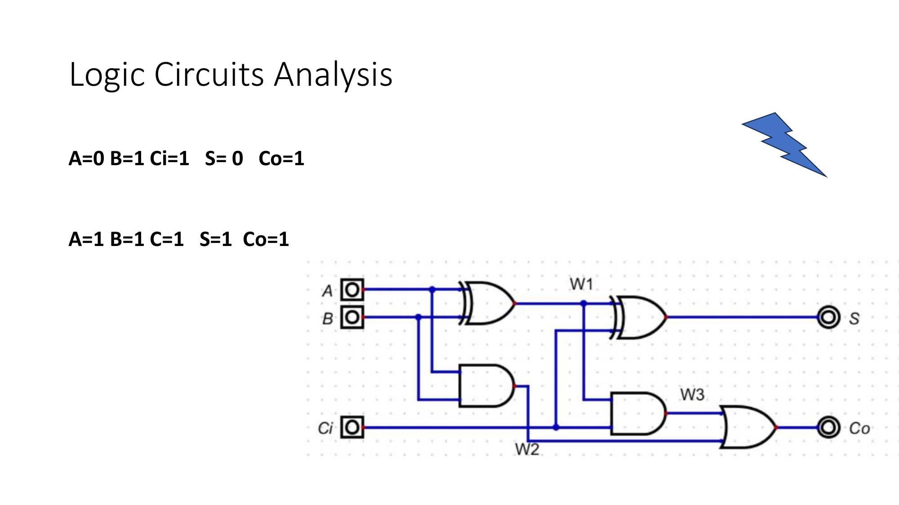
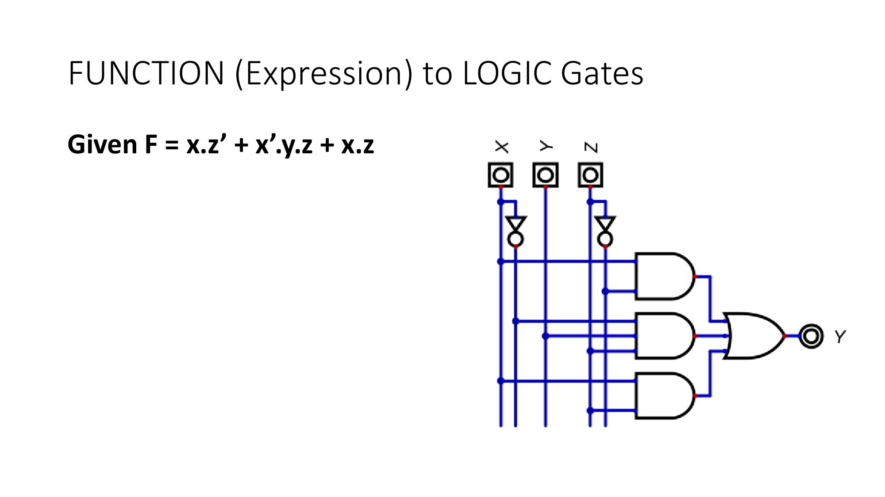
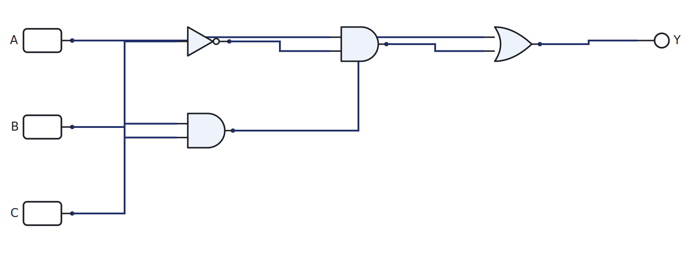

# Week 4: The design chain

[🏠 Home](../) · Prev: [Week 3](week03-boolean-algebra-gates.html) · Next: [Week 5](week05-karnaugh-maps.html)

> **Goal.** Lock in the one method you will use for every circuit in this course:
> **truth table to minterms to expression to gate circuit**, and the reverse, reading a circuit
> back to its behaviour.

## Two directions

There are only two things you ever do with a logic circuit.

- **Analysis**: you are given the circuit and you work out what it does. Inputs in, trace
  through the gates, outputs out.
- **Synthesis**: you are given the behaviour you want and you build the circuit that does it.

The whole week is these two directions, and a fixed recipe for the second one.

## Reading a circuit (analysis)

Given the inputs, follow each wire through its gate and write the output. Naming every gate's
output as you go turns a tangle of wires into a short expression.

Work left to right: label the output of each gate with its expression, then combine. The final
label on the output wire is the circuit's Boolean expression.

## From a diagram to an expression, and back

Once you can read a diagram into an expression, the reverse is mechanical: every operator in the
expression is one gate, and parentheses tell you the order to wire them.

## The design guide: a V for logic

Engineering uses the **V-cycle**: you specify on the way down and verify on the way up. Logic
design is the same shape:

- **Down the left (specify):** requirement in words, then a truth table, then minterms, then a
  Boolean expression.
- **At the bottom (build):** the gate circuit.
- **Up the right (verify):** simulate it, then build it on the bench, then confirm it meets the
  requirement you started with.

Every design in this course walks that V.

## The design chain

This is the recipe, and we use **minterms only**, because one method is enough.

1. Write the **truth table** from the requirement.
2. Mark every row where the output is **1**; each is a **minterm** (a product of the inputs,
   complemented where the input is 0).
3. **OR** the minterms together: that is the expression, in sum-of-products form.
4. Draw the **circuit**: one AND per minterm, one OR to combine, inverters where needed.

A worked example, `Y = A·B + A·C'`:

[▶ Open in LogicLab](https://senolgulgonul.github.io/logiclab/?circuit=https%3A%2F%2Fsenolgulgonul.github.io%2Flogic%2Fexamples%2Fw04-sop-example.logiclab.json)

A larger design, the **7-segment** display, uses exactly this chain, one expression per segment.
We build it fully when we reach decoders.

## Building and verifying in LogicLab

LogicLab is a **build-and-verify** tool, not a solver. It will not write the truth table for you
and it will not synthesise a circuit from an expression; doing those by hand is the skill. What
it does is let you confirm your work and feel the circuit behave.

- **Build it.** Place the gates, wire each output pin to an input pin, then press power. A wire
  glows when it carries a 1.
- **Verify it.** Toggle the input switches through every combination and read the output LED.
  Each row should match the truth table you wrote by hand.
- **Store a truth table directly.** The **LUT4** part holds a 16-row, 4-input truth table you set
  as a hex value, so you can drop a function straight onto the sheet and compare it against your
  gate circuit.
- **The Shannon check.** Build Shannon's original expression and your minimised version side by
  side, toggle the inputs, and confirm the two outputs always agree. That is minimisation made
  visible, and it replaces the old simulator walkthrough.

## Try it yourself (optional)

Build the SOP example on the breadboard with real gate ICs, drive the inputs from the Arduino,
and read the output. Bench, simulator, and truth table should all agree. See the
[Lab Annex](../annex-lab-arduino.html).

## Check yourself

- Analyse the circuit above and write its expression without looking at the caption.
- Synthesise `Y = A'·B + A·B'` from scratch and confirm in LogicLab that it is just XOR.
- What 4-digit hex value loads into a LUT4 to make it behave as `Y = A·B + A·C'`?
