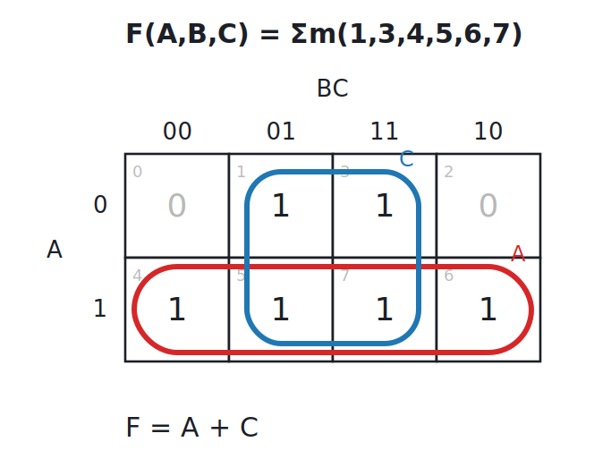
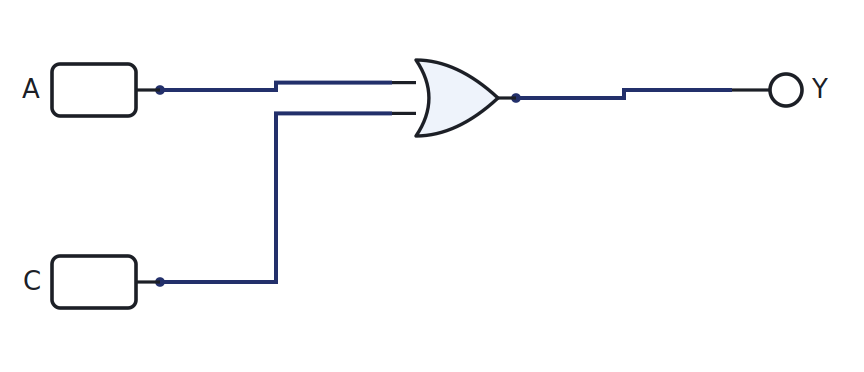
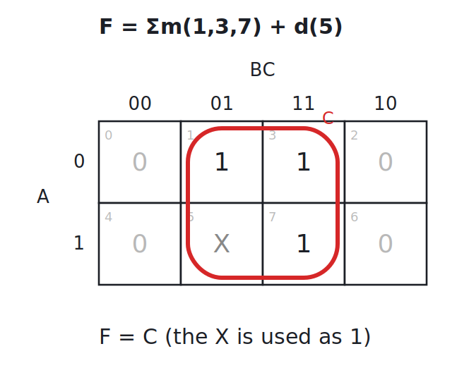

# Week 5: Minimisation with Karnaugh maps

[🏠 Home](../) · Prev: [Week 4](week04-design-chain-minterms.html) · Next: [Week 6](week06-binary-arithmetic-adder.html)

> **Goal.** Take the sum-of-products expression from the design chain and make it small, so the
> circuit uses fewer gates. We do this with Karnaugh maps, by eye, with three variables.

## Why minimise

The minterm expression from Week 4 is always correct, but it is rarely the smallest. Fewer gates
means a cheaper, faster, lower-power circuit. A Karnaugh map is a way to spot the simplifications
visually instead of grinding through algebra.

## Adjacency and the Gray-code order

A K-map is just the truth table folded into a grid so that **neighbouring cells differ in one
variable**. That is why the columns run `00, 01, 11, 10` and not `00, 01, 10, 11`: each step
flips a single bit, so two adjacent 1s can always be combined.

## The three-variable map

Plot a 1 in every cell whose minterm is 1, then circle the **largest legal groups** (sizes 1, 2,
4, 8: always a power of two), and read each group as the product of the variables that stay
constant inside it.

Here the bottom row is constant in `A = 1`, so it reads `A`; the middle two columns are constant
in `C = 1`, so they read `C`. The six-minterm expression collapses to `F = A + C`, a single OR
gate:

[▶ Open in LogicLab](https://senolgulgonul.github.io/logiclab/?circuit=https%3A%2F%2Fsenolgulgonul.github.io%2Flogic%2Fexamples%2Fw05-minimized-a-or-c.logiclab.json){:target="_blank" rel="noopener"}

**Grouping rules.** Groups must be rectangles of 1, 2, 4, or 8 cells; bigger is better; every 1
must be covered at least once; groups may overlap; and the map wraps around, so the left and
right edges (and top and bottom) are neighbours.

## Don't-care conditions

Sometimes an input combination can never happen, or its output does not matter. Mark it `X`, then
treat each `X` as a **1 or a 0, whichever makes a bigger group**. Here the single X lets the C
column become a full group of four, so the answer is simply `F = C`:

## Realising it with NAND or NOR only

By DeMorgan, any sum-of-products can be built from **NAND gates alone**, and any product-of-sums
from **NOR gates alone**. Factories like this: one gate type, repeated. To convert an AND-OR
circuit to NAND-NAND, replace every gate with a NAND and the logic is unchanged. Build both forms
in LogicLab and toggle the inputs to confirm they agree.

## XOR and parity

XOR is its own useful tool: it is 1 when its inputs differ. Chain XORs and you get a **parity**
function, which is 1 when an odd number of inputs are 1. That is how a parity bit detects a
single-bit error, and it reappears in the adder's sum bit.

## Reading a datasheet: active-high and active-low

On a real IC, a pin is **active-high** if it does its job when driven to 1, and **active-low**
(marked with an overline) if it does its job when driven to 0. Reset and enable pins are very
often active-low. Always check the datasheet's logic table before you wire a part, because the
silicon does not care which convention you assumed.

## Try it yourself (optional)

Take a function, minimise it on paper, build the minimised circuit on the breadboard, and confirm
with the Arduino that every input combination matches the original truth table. See the
[Lab Annex](../annex-lab-arduino.html).

## Check yourself

- Plot `F = Σm(0,2,4,6)` on a 3-variable map and minimise it. (Hint: one group of four.)
- Add the don't-care `d(7)` to `F = Σm(3,5)` and see whether it helps.
- Convert `F = A·B + C` to a NAND-only circuit and verify it in LogicLab.
