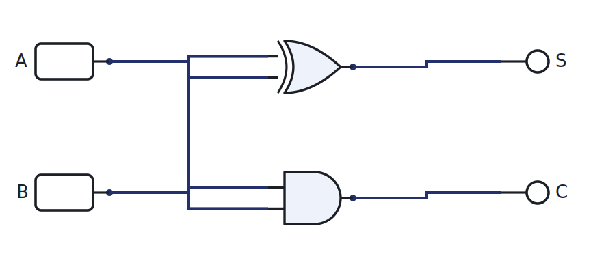
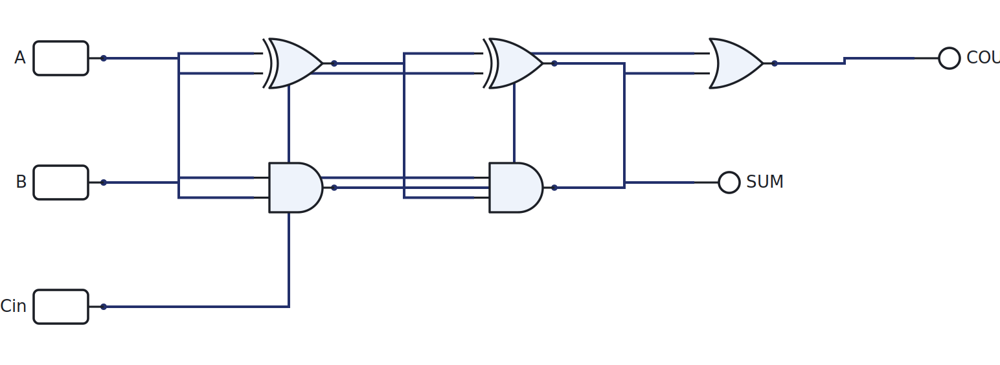
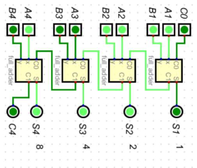

# Week 6: Binary arithmetic and the adder

[🏠 Home](../) · Prev: [Week 5](week05-karnaugh-maps.html) · Next: [Week 7](week07-subtractor-alu.html)

> **Goal.** Build the circuit that adds. The adder is the heart of every ALU, so this is the
> first real piece of the microcontroller. This week is **addition only**; subtraction is next.

## Adding in binary

Binary addition is the grade-school method with only two digits. Column by column you add the two
bits and any carry coming in, write the sum bit, and pass a carry out to the next column. So the
job splits into a small cell that adds three bits, repeated across the word.

## The half adder

The half adder adds **two** bits and produces a sum and a carry. The sum is XOR (1 when the bits
differ) and the carry is AND (1 only when both are 1).

| A | B | C | S |
|---|---|---|---|
| 0 | 0 | 0 | 0 |
| 0 | 1 | 0 | 1 |
| 1 | 0 | 0 | 1 |
| 1 | 1 | 1 | 0 |

[▶ Open in LogicLab](https://senolgulgonul.github.io/logiclab/?circuit=https%3A%2F%2Fsenolgulgonul.github.io%2Flogic%2Fexamples%2Fw06-half-adder.logiclab.json)

## The full adder

A real column also has a **carry in**, so it adds **three** bits: A, B, and Cin. Build it from two
half adders and an OR: one half adder adds A and B, the second adds that sum to Cin, and the OR
combines the two carries.

| A | B | Cin | Cout | S |
|---|---|-----|------|---|
| 0 | 0 | 0 | 0 | 0 |
| 0 | 0 | 1 | 0 | 1 |
| 0 | 1 | 0 | 0 | 1 |
| 0 | 1 | 1 | 1 | 0 |
| 1 | 0 | 0 | 0 | 1 |
| 1 | 0 | 1 | 1 | 0 |
| 1 | 1 | 0 | 1 | 0 |
| 1 | 1 | 1 | 1 | 1 |

[▶ Open in LogicLab](https://senolgulgonul.github.io/logiclab/?circuit=https%3A%2F%2Fsenolgulgonul.github.io%2Flogic%2Fexamples%2Fw06-full-adder.logiclab.json)

## The 4-bit adder

Chain four full adders. Each one's **carry out** feeds the next one's **carry in**, so the carry
ripples from the least significant bit up to the most significant.

The full adder above is the single building block; the 4-bit adder is just four of them in a row.

## Carry propagation, and why real adders are not a plain cascade

The cascade is easy to understand, but it has a cost. The top bit's sum cannot settle until the
carry has rippled all the way up from the bottom, so a 4-bit adder waits for four carry delays,
an 8-bit adder for eight, and so on. The delay grows with the word length.

That is why a real adder IC is **not** just cascaded full adders. It uses **carry-lookahead**:
extra logic computes the carries in parallel from the inputs, instead of waiting for them to
ripple. So when you open an adder datasheet and the circuit looks more complicated than four full
adders in a row, that is the reason, and it is no surprise.

## Toward the ALU

The adder you built is the core of the **arithmetic logic unit**, the part of the MCU that
computes. Next week we add one Mode line and turn this adder into an adder **and** subtractor,
which is a basic ALU.

## In the lab

The half adder is the course's combinational lab. Build it in the simulator (**Lab 1**) and then on a breadboard with real XOR and AND ICs driven by the Arduino (**Lab 2**). Full instructions are in the [Lab Annex](../annex-lab-arduino.html).

## Check yourself

- Fill the full-adder truth table from scratch, then confirm it in LogicLab.
- How many carry delays does a 16-bit ripple-carry adder take in the worst case?
- Add `1011 + 0110` by hand, then check it on the 4-bit adder.
