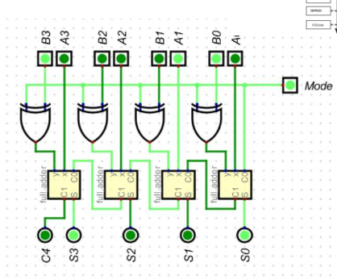
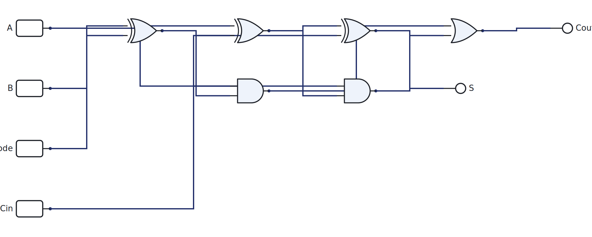

# Week 7: Subtraction and a first ALU

[🏠 Home](../) · Prev: [Week 6](week06-binary-arithmetic-adder.html) · Next: [Week 8](week08-mcu-combinational-blocks.html)

> **Goal.** Make the adder subtract too, using one extra control line. The result is a **basic
> ALU**, the compute unit of the microcontroller.

## Subtraction is addition in disguise

We do not build a separate subtractor. In **two's complement**, the negative of a number is found
by inverting every bit and adding 1. So

`A − B = A + (NOT B) + 1`

That is just an addition, with B inverted and a 1 forced into the lowest carry in. We already have
an adder, so subtraction costs almost nothing extra.

## One control line: the adder/subtractor

Put an XOR gate on each B bit, with its other input tied to a shared **Mode** line, and connect
Mode to the adder's lowest carry in:

- **Mode = 0:** XOR passes B through unchanged and the carry in is 0, so the circuit **adds**.
- **Mode = 1:** XOR inverts every B bit and the carry in is 1, which is exactly `NOT B + 1`, so
  the circuit **subtracts**.

The single-bit cell makes the trick clear: `B XOR Mode` feeds an ordinary full adder. Open it,
set Mode, and watch the same hardware add or subtract:

[▶ Open in LogicLab](https://senolgulgonul.github.io/logiclab/?circuit=https%3A%2F%2Fsenolgulgonul.github.io%2Flogic%2Fexamples%2Fw07-addsub-cell.logiclab.json)

## Overflow

With signed numbers, the result can be too big for the word. **Overflow** happens when the carry
**into** the most significant bit differs from the carry **out** of it. In practice it shows up
when you add two numbers of the same sign and get a result with the opposite sign. The hardware
flags it with a single XOR of those two carries, and software checks that flag.

## A word on multiplication

Multiplication is repeated shift-and-add: for each 1 in the multiplier, add a shifted copy of the
multiplicand. It is built from the same adders, just more of them, so we name it here but do not
wire the whole array. Addition and subtraction are all the MCU's ALU will need.

## This is the ALU

An adder/subtractor plus a function-select line is a **basic arithmetic logic unit**. Give it a
few more operations (AND, OR, compare) selected by control bits and you have the compute core of a
processor. When we build the MCU, this block is the `ALU`, fed by two registers and told what to
do by the control logic.

## Try it yourself (optional)

Build the adder/subtractor on the breadboard, flip the Mode switch, and confirm it adds and
subtracts. Use the Arduino overflow cross-check in the [Lab Annex](../annex-lab-arduino.html).

## Check yourself

- Compute `0110 − 0011` by the two's-complement method by hand, then verify on the cell.
- Why must Mode also drive the lowest carry in, not just the XOR gates?
- Add `0100 + 0101` as signed 4-bit numbers. Does it overflow, and how would the hardware know?
