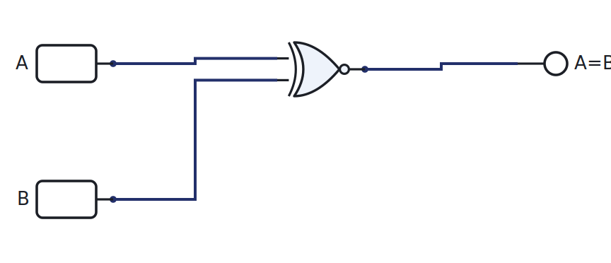
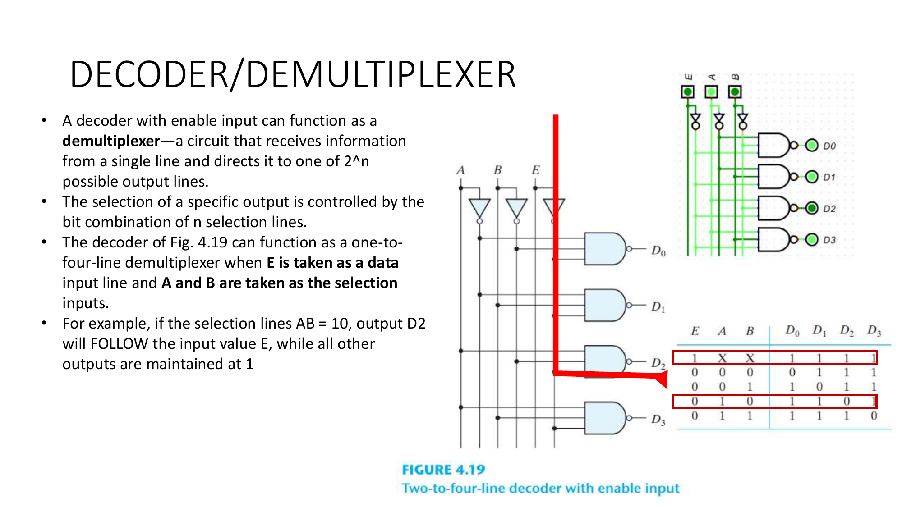
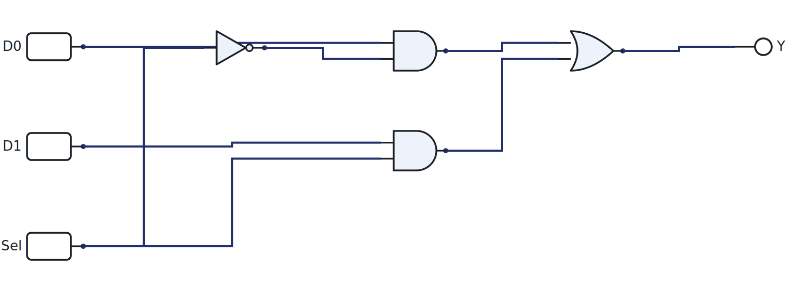
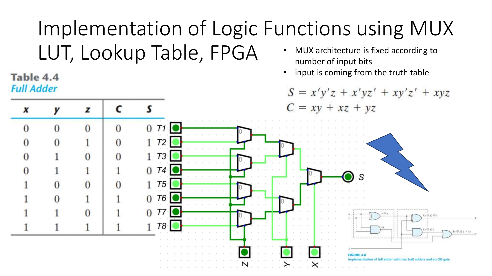
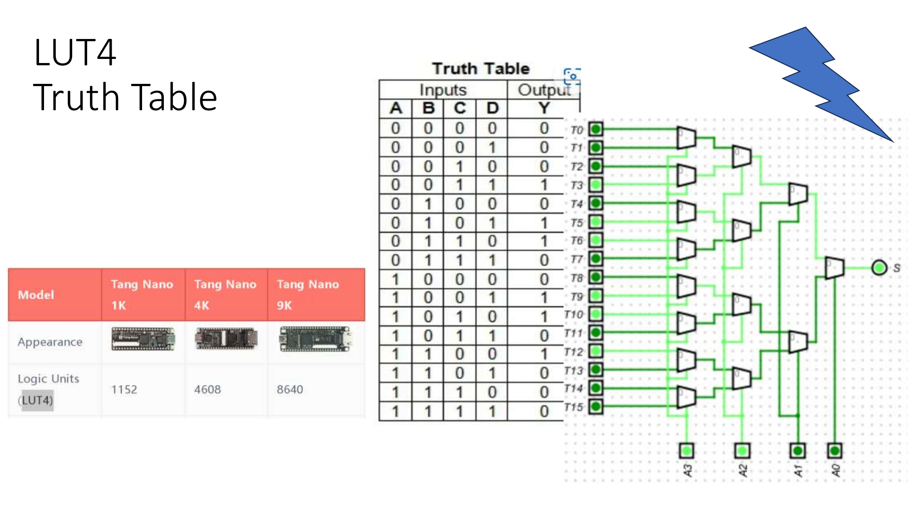

# Week 8: The MCU's combinational blocks

[🏠 Home](../) · Prev: [Week 7](week07-subtractor-alu.html) · Next: [Week 9](week09-flipflops.html)

> **Goal.** Finish combinational logic by building the remaining pieces that sit inside the
> microcontroller: the comparator, the decoder, the encoder, the multiplexer, and the lookup
> table. Each one is here because the MCU needs it.

## Comparator

A comparator tells you whether two values are equal. For one bit, equality is **XNOR**: the
output is 1 exactly when the bits match. For a wider word, XNOR each bit pair and AND the
results together.

[▶ Open in LogicLab](https://senolgulgonul.github.io/logiclab/?circuit=https%3A%2F%2Fsenolgulgonul.github.io%2Flogic%2Fexamples%2Fw08-comparator-1bit.logiclab.json)

## Decoder and demultiplexer

A decoder turns an n-bit address into one **one-hot** output: exactly one of its 2^n lines goes
high, the one the address points at. In the MCU this is how an address selects a single ROM or
RAM row, and how an instruction selects a single control action.

A demultiplexer is the same circuit with a data input gated onto the selected line.

## Encoder

An encoder is the decoder run backwards: given one active input line, it outputs the binary
number of that line. A **priority** encoder breaks ties by always reporting the highest active
line, which is how interrupt hardware decides what to service first.

## Multiplexer

A multiplexer selects **one of several inputs** and passes it to the output, chosen by select
lines. A 2-to-1 MUX is `Y = D0·Sel' + D1·Sel`.

[▶ Open in LogicLab](https://senolgulgonul.github.io/logiclab/?circuit=https%3A%2F%2Fsenolgulgonul.github.io%2Flogic%2Fexamples%2Fw08-mux-2to1.logiclab.json)

A MUX can also **implement any logic function**: wire the truth-table outputs to the data inputs
and drive the select lines with the variables.

## Lookup table (LUT)

Push that idea one step further and store the truth-table outputs in memory instead of wiring
them. That is a **lookup table**, and it is the basic cell of an FPGA. LogicLab's LUT4 holds a
16-row, 4-input table as a hex value.

## Why these are the MCU's blocks

The **decoder** picks instructions and memory rows, the **multiplexer** routes data between
units, the **comparator** evaluates conditions, and the **LUT** is the bridge to programmable
logic. Together with the ALU from Week 7, these are every combinational part the Week 14 MCU
needs.

## Try it yourself (optional)

Build the 2-to-1 MUX on the breadboard, drive the select line from the Arduino, and confirm it
passes the chosen input. See the [Lab Annex](../annex-lab-arduino.html).

## Check yourself

- Extend the 1-bit comparator to 2 bits. How many XNORs and what combines them?
- A 3-to-8 decoder has how many outputs, and how many are high at once?
- Use a 2-to-1 MUX to build a NOT gate. (Hint: tie the data inputs to constants.)
