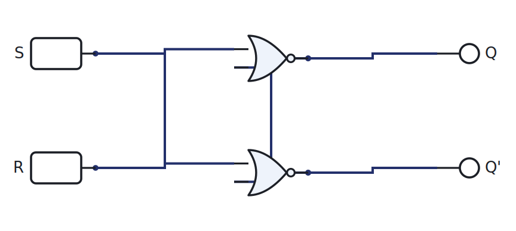
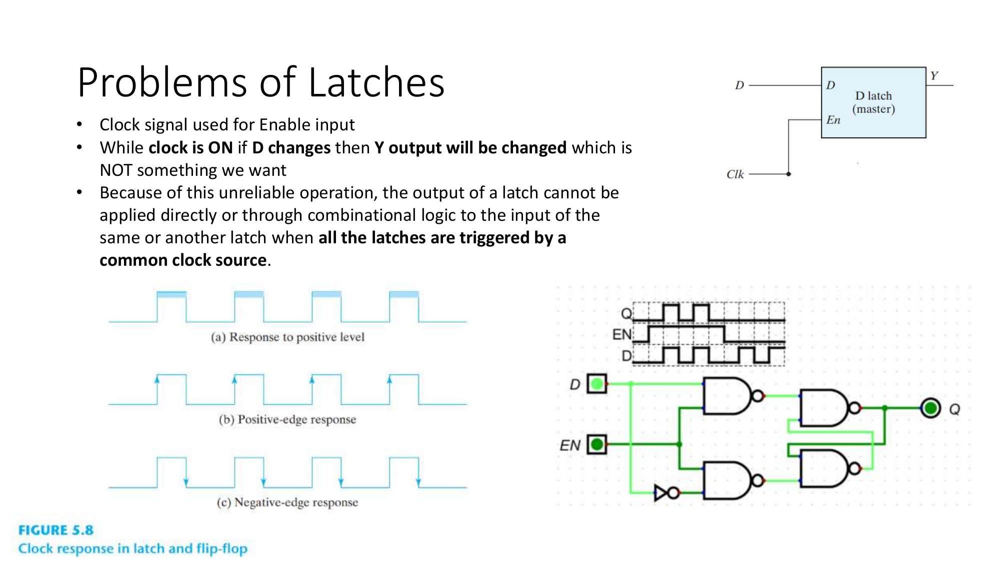
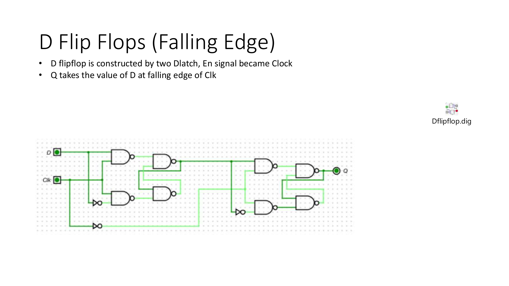
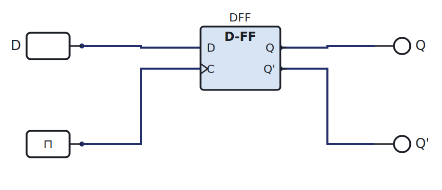

# Week 9: The first flip-flop

[🏠 Home](../) · Prev: [Week 8](week08-mcu-combinational-blocks.html) · Next: [Week 10](week10-sequential-design-truth-table.html)

> **Goal.** Add **memory**. Everything so far has been combinational: the output depends only on
> the present inputs. A flip-flop remembers, and that is what turns logic into a machine with
> state.

## The SR latch: the first bit of memory

Cross-couple two NOR gates, feeding each output back into the other's input, and the circuit can
**hold** a value. Set (S) forces the stored bit to 1, Reset (R) forces it to 0, and with both
inputs 0 it **remembers** the last value.

[▶ Open in LogicLab](https://senolgulgonul.github.io/logiclab/?circuit=https%3A%2F%2Fsenolgulgonul.github.io%2Flogic%2Fexamples%2Fw09-sr-latch.logiclab.json){:target="_blank" rel="noopener"}

The combination S = R = 1 is **forbidden**, because it drives both outputs to the same value and
the next state is ambiguous.

## The problem with latches

A plain latch is **transparent**: while it is enabled, the output follows the input continuously,
so any glitch on the input passes straight through, and feedback circuits can race.

We want a circuit that samples its input at one **instant**, not for a whole interval.

## The edge-triggered D flip-flop

The D flip-flop solves this: it copies D to Q **only on the clock edge**, and ignores D the rest
of the time. One data input, one clock, and the stored bit changes once per clock tick.

[▶ Open in LogicLab](https://senolgulgonul.github.io/logiclab/?circuit=https%3A%2F%2Fsenolgulgonul.github.io%2Flogic%2Fexamples%2Fw09-dflipflop.logiclab.json){:target="_blank" rel="noopener"}

Open it, set D, and press the clock's single-step button: Q takes D's value on the edge and holds
it until the next edge.

## One flip-flop to rule them all

JK and T flip-flops exist, but we use the **D flip-flop only**. It is the simplest to reason
about, and as the next week shows, it makes sequential design identical to the combinational
design you already know.

## Try it yourself (optional)

Build the SR latch from a NOR-gate IC, toggle S and R from the Arduino, and watch it hold. See
the [Lab Annex](../annex-lab-arduino.html).

## Check yourself

- Why is S = R = 1 forbidden on the NOR latch?
- What is the difference between "level-sensitive" and "edge-triggered"?
- On a rising-edge D flip-flop, D changes just after the edge. When does Q change?
