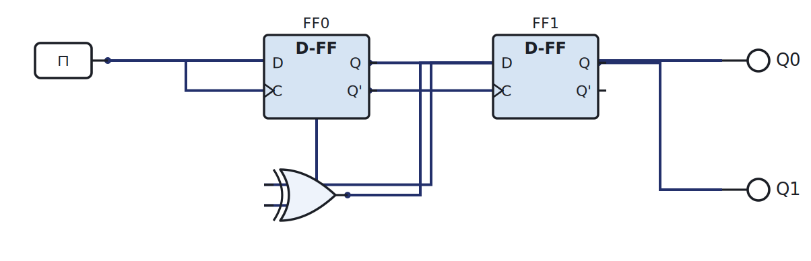
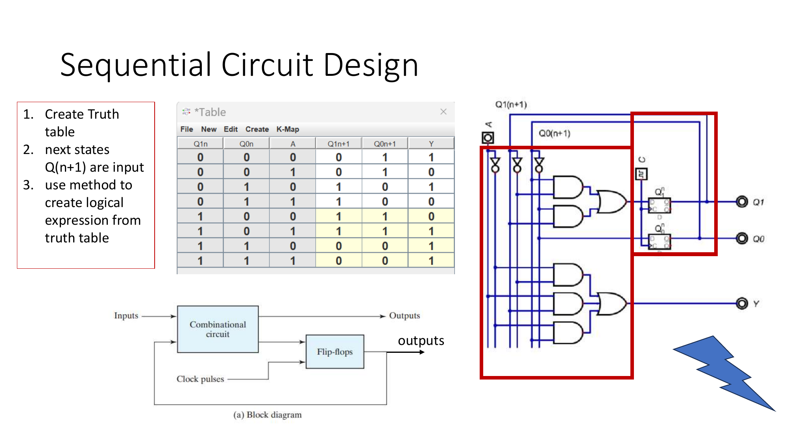

# Week 10: Sequential design, one method

[🏠 Home](../) · Prev: [Week 9](week09-flipflops.html) · Next: [Week 11](week11-counters-program-counter.html)

> **Goal.** Design **any** sequential circuit with the same truth-table method you already use
> for combinational logic. No new theory, no excitation tables.

## The whole idea

A sequential circuit is just **combinational logic plus flip-flops**:

- The flip-flop **outputs** are the **present state**. Treat them as extra **inputs** to your
  combinational logic.
- The flip-flop **inputs** are the **next state**. Treat them as extra **outputs** of your
  combinational logic.

And because we use **D flip-flops**, the rule `Q_next = D` means the next state *is* the D input.
So you never need an excitation table: whatever you want the next state to be, that is what you
feed to D.

## The recipe

1. Decide the states and draw the **next-state truth table**: columns are *present state + inputs*
   on the left, *next state + outputs* on the right.
2. For each next-state bit, read its column as a function of the present-state and input columns.
3. Minimise it (Karnaugh map) and that expression is the **D input** for that flip-flop.
4. Wire the combinational logic to the D inputs, share one clock across all flip-flops, done.

It is the Week 4 design chain, with the present state added as inputs.

## Worked example: a 2-bit counter

We want the state to step `00 → 01 → 10 → 11 → 00`. Present state `Q1 Q0`, next state `Q1+ Q0+`:

| Q1 | Q0 | Q1+ | Q0+ |
|----|----|-----|-----|
| 0  | 0  | 0   | 1   |
| 0  | 1  | 1   | 0   |
| 1  | 0  | 1   | 1   |
| 1  | 1  | 0   | 0   |

Reading the columns: `Q0+ = Q0'` (it toggles every clock) and `Q1+ = Q1 ⊕ Q0` (it toggles when
Q0 is 1). Those become the D inputs: `D0 = Q0'`, `D1 = Q1 ⊕ Q0`.

[▶ Open in LogicLab](https://senolgulgonul.github.io/logiclab/?circuit=https%3A%2F%2Fsenolgulgonul.github.io%2Flogic%2Fexamples%2Fw10-2bit-counter.logiclab.json)

Step the clock and watch the two LEDs count in binary.

## In the lab

The 2-bit counter is the course's sequential lab. Build it in the simulator (**Lab 3**) and then on a breadboard with a dual D flip-flop IC clocked by the Arduino (**Lab 4**). Full instructions are in the [Lab Annex](../annex-lab-arduino.html).

## Check yourself

- Write the next-state table for a counter that goes `00 → 10 → 01 → 11 → 00` and find D0, D1.
- Add an input `Up` that makes the 2-bit counter count down when it is 0.
- Why does sharing one clock across both flip-flops matter?
