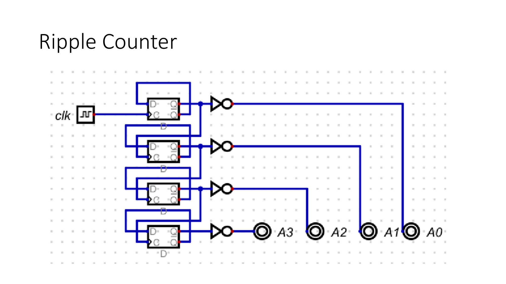
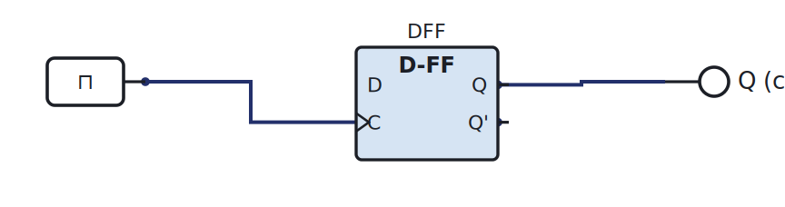

# Week 11: Counters, dividers, and the program counter

[🏠 Home](../) · Prev: [Week 10](week10-sequential-design-truth-table.html) · Next: [Week 12](week12-registers-shift-memory-elements.html)

> **Goal.** Use flip-flops to count. A counter is the heart of the microcontroller's **program
> counter**, the register that decides which instruction runs next.

## Ripple (asynchronous) counters

The quickest counter to build: clock the first flip-flop, then let each flip-flop's output clock
the next. The count "ripples" up the chain.

It is simple, but like the ripple-carry adder it has a delay: the top bit only settles after the
change has rippled through every stage. For fast or precise timing you use a **synchronous**
counter instead, where every flip-flop shares one clock, designed by the Week 10 method.

## Frequency divider

A single D flip-flop with its **Q' fed back to D** toggles on every clock edge, so its output is
the clock at **half** the frequency. Chain them and each stage halves again: divide by 2, 4, 8.

[▶ Open in LogicLab](https://senolgulgonul.github.io/logiclab/?circuit=https%3A%2F%2Fsenolgulgonul.github.io%2Flogic%2Fexamples%2Fw11-freq-divider.logiclab.json){:target="_blank" rel="noopener"}

This is also why a ripple counter's bits are a chain of divided clocks.

## BCD counter

A counter that resets after 9 instead of after 15 counts in **binary-coded decimal**, one decimal
digit per 4 bits. Detect the count reaching ten and clear the flip-flops. It is what drives a
decimal display.

## The program counter

Now the payoff. A **program counter (PC)** is just a counter whose value is the **address of the
next instruction**. Each clock it increments, the ROM hands back the instruction at that address,
and the machine executes it.

When we build the MCU, the PC steps through the program in ROM exactly like this counter steps
through its states.

## Try it yourself (optional)

Build a divide-by-2 with one flip-flop, watch the output on the logic analyser at half the clock,
then chain a second stage. See the [Lab Annex](../annex-lab-arduino.html).

## Check yourself

- How many flip-flops does a counter that reaches 100 need?
- A 1 MHz clock through three divide-by-2 stages gives what frequency?
- Why does a program counter need a way to **load** a value, not only increment? (Think jumps.)
