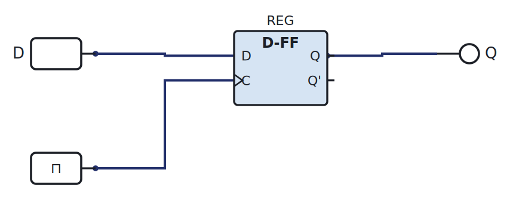
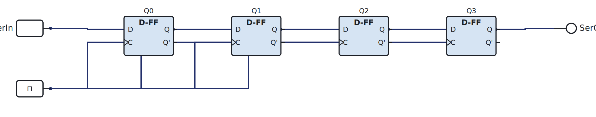

# Week 12: Registers and memory elements

[🏠 Home](../) · Prev: [Week 11](week11-counters-program-counter.html) · Next: [Week 13](week13-memory-rom-ram.html)

> **Goal.** Group flip-flops into **registers**, the small fast storage the MCU uses for its
> working values. The MCU's RA and RB are registers built exactly this way.

## A flip-flop is a 1-bit register

One D flip-flop stores one bit: load it on the clock edge, and it holds that bit until the next
edge.

[▶ Open in LogicLab](https://senolgulgonul.github.io/logiclab/?circuit=https%3A%2F%2Fsenolgulgonul.github.io%2Flogic%2Fexamples%2Fw12-1bit-register.logiclab.json)

## An n-bit register

Put **n** D flip-flops side by side, all sharing one clock, and you store an n-bit word in one
tick. Add a **load/enable** line (gate the clock or multiplex the input with the current value)
so the register only updates when you ask it to. The MCU's registers A and B are 4-bit registers
with exactly this enable.

## Shift registers

Chain the flip-flops instead, feeding each output into the next one's input. On every clock the
data **shifts** one position along the chain.

[▶ Open in LogicLab](https://senolgulgonul.github.io/logiclab/?circuit=https%3A%2F%2Fsenolgulgonul.github.io%2Flogic%2Fexamples%2Fw12-shift-register.logiclab.json)

Serial in, serial out turns one wire into many over several clocks (and back), which is how a few
pins drive many outputs. Parallel-load and parallel-out variants exist too.

## Mealy and Moore machines

A sequential machine's outputs can be defined two ways, and these are the two **categories** you
should recognise:

- **Moore:** outputs depend on the **state only**. The output changes only after a clock edge,
  which makes it clean and glitch-free.
- **Mealy:** outputs depend on the **state and the current inputs**. It can react one clock
  sooner, at the cost of following input glitches.

We do not design with formal state-machine diagrams beyond the truth-table method of Week 10;
knowing the two categories is enough.

## Try it yourself (optional)

Build a 4-bit shift register from D flip-flops, clock it from the Arduino, and watch a single 1
walk along the outputs on the logic analyser. See the [Lab Annex](../annex-lab-arduino.html).

## Check yourself

- How many clocks to load a 4-bit value into a shift register serially? To read it out?
- Sketch how a load/enable line stops a register from updating every clock.
- Is a simple counter a Moore or a Mealy machine?
