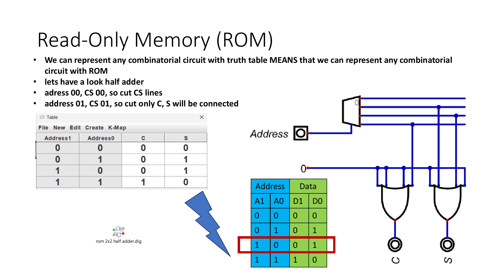
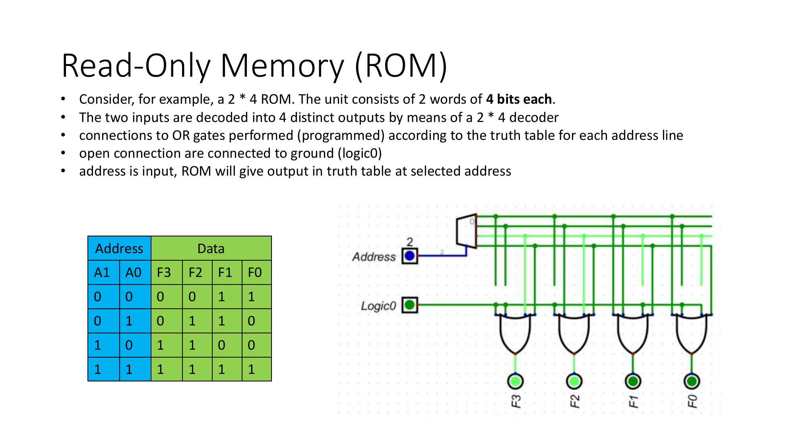
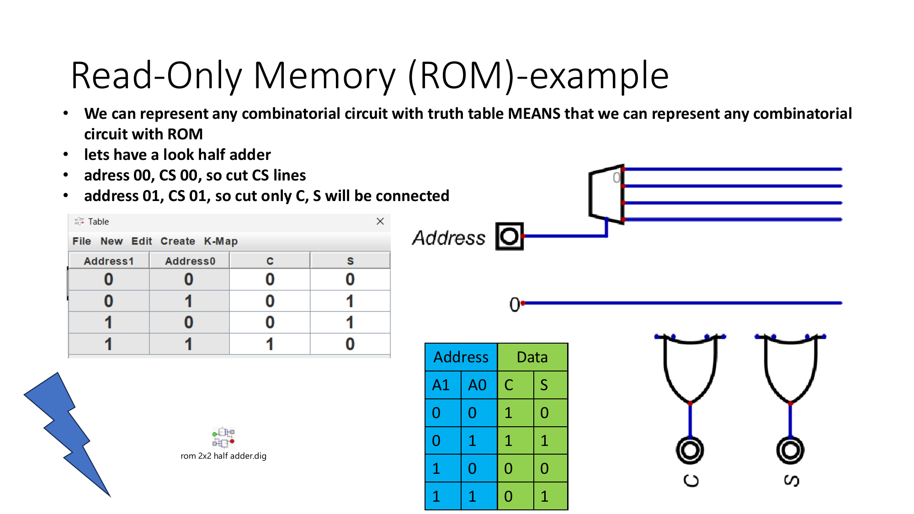
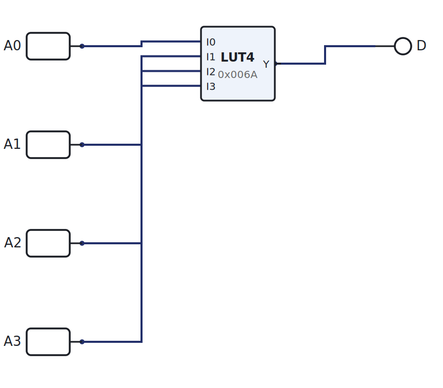
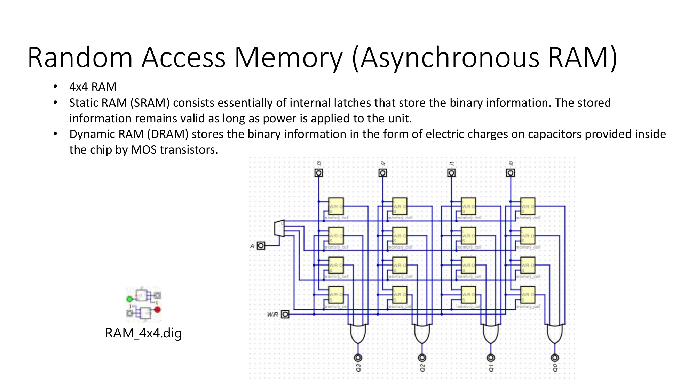

# Week 13: Memory

[🏠 Home](../) · Prev: [Week 12](week12-registers-shift-memory-elements.html) · Next: [Week 14](week14-build-the-mcu.html)

> **Goal.** Build memory from the parts you already know. The MCU keeps its **program** in ROM
> and its **data** in RAM, and both are just decoders and storage cells.

## ROM as a decoder plus OR gates

A read-only memory is easy to understand if you build it by hand. An **address decoder** turns
the address into one-hot row lines, and an **OR plane** reads off the stored word: wherever a bit
should be 1, that row line is wired into the OR gate for that output column.

The "program" is literally which row-to-column wires are present.

## From hard-wired to flash

In a classic ROM those connections are **hard-wired** at manufacture, so the contents can never
change. Modern memory replaces each fixed wire with a **transistor** you can switch on or off
electrically: that is EPROM (erased with UV light), then flash, which you erase and rewrite in
place. Same decoder-and-array idea, programmable connections.

## ROM is a lookup table

A small ROM is exactly a **lookup table**. LogicLab's LUT4 is a 16-entry, 4-input ROM whose
contents you set as a hex value, so you can address it with switches and read the stored bit.

[▶ Open in LogicLab](https://senolgulgonul.github.io/logiclab/?circuit=https%3A%2F%2Fsenolgulgonul.github.io%2Flogic%2Fexamples%2Fw13-lut-rom.logiclab.json)

## RAM as a grid of registers

Random-access memory is a **grid of 1-bit storage cells**, addressed by row and column, that you
can both **read and write**. Think of it as a block of registers with an address decoder choosing
which one is connected to the data lines.

Asynchronous RAM responds as soon as the address settles; synchronous RAM latches the address on
a clock edge, like the registers from last week.

## The MCU's two memories

The Week 14 MCU uses a **ROM** to hold its program (the program counter walks its addresses) and
a **RAM** to hold data the program reads and writes. You have now built both.

## Try it yourself (optional)

Wire a tiny ROM as a 2-to-4 decoder feeding OR gates for a 2-bit output, set a pattern, and read
each address from the Arduino. See the [Lab Annex](../annex-lab-arduino.html).

## Check yourself

- A ROM with a 4-bit address and an 8-bit word stores how many bits in total?
- What hex value loads into a LUT4 so it outputs 1 only at addresses 0, 5, and 15?
- What does RAM have that ROM does not, and what circuit provides it?
