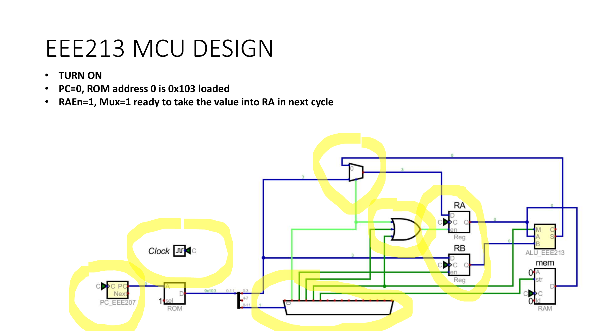

# Week 14: Build the MCU

[🏠 Home](../) · Prev: [Week 13](week13-memory-rom-ram.html)

> **Goal.** Put every block together into a working **4-bit microcontroller**, load a small
> program into its ROM, and step through it. This is the whole course in one circuit.

## Open the MCU

The complete machine runs in LogicLab. Open it, press power, and single-step the clock to watch
it execute:

[▶ Open the 4-bit MCU in LogicLab](https://senolgulgonul.github.io/logiclab/?circuit=https%3A%2F%2Fraw.githubusercontent.com%2Fsenolgulgonul%2Flogiclab%2Fmain%2Fmcu_v4.logiclab.json)

## It is all blocks you have built

LogicLab now provides each datapath part as a single block, so the MCU is a small diagram rather
than a sea of gates. Every block is something you built up from gates in an earlier week:

- **CNT4** is the **program counter** (the counter from [Week 11](week11-counters-program-counter.html)): it holds the address of the next instruction.
- **ROM8** holds the **program** (the memory from [Week 13](week13-memory-rom-ram.html)); the PC addresses it and it returns the instruction word as a parallel output.
- **DEC4** and a couple of **OR** gates are the **control logic** (the decoder from [Week 8](week08-mcu-combinational-blocks.html)): they read the instruction and raise the right control lines.
- **MUX2** blocks **route the data** (the multiplexer from [Week 8](week08-mcu-combinational-blocks.html)): they choose whether a register loads an operand or the ALU result.
- **REG4** are the working registers **RA and RB** (the register from [Week 12](week12-registers-shift-memory-elements.html)).
- **ALU4** is the **arithmetic unit** (the adder/subtractor from [Week 7](week07-subtractor-alu.html)).
- **RAM8** is the **data memory** (also [Week 13](week13-memory-rom-ram.html)); STS writes a result into it.

Add the clock, and it is a computer.

## The ROM is the program

The program lives in ROM8 as a parallel instruction word, split off to the decoder path (control)
and the register path (operand). This is the program stored in it:

| Addr | Instruction | enA | enB | Mode | MUX | str | Operand |
|------|-------------|-----|-----|------|-----|-----|---------|
| 0 | LDA 3 | 1 | 0 | 0 | 1 | 0 | 3 |
| 1 | LDB 2 | 0 | 1 | 0 | 0 | 0 | 2 |
| 2 | ADD   | 1 | 0 | 0 | 0 | 0 | - |
| 3 | SUB   | 1 | 0 | 1 | 0 | 0 | - |
| 4 | STS   | 0 | 0 | 0 | 0 | 1 | - |
| 5-7 | NOP | 0 | 0 | 0 | 0 | 0 | - |

## von Neumann vs Harvard

In the **von Neumann** architecture instructions and data share one memory; in the **Harvard**
architecture they are separate (here, ROM8 for the program, RAM8 for data), so the machine can
fetch an instruction and access data at once. Our MCU is Harvard.

## Running the program

Each clock: **CNT4** addresses **ROM8**, the instruction word drives **DEC4** and the control OR
gates, those control lines set the **MUX2** routing, the **REG4** load enables, and the **ALU4**
mode, and the data flows accordingly. Tracing `LDA 3; LDB 2; ADD; SUB; STS`:

1. **LDA 3:** the MUX picks the operand, enA loads it. RA = 3.
2. **LDB 2:** enB loads the operand. RB = 2.
3. **ADD:** Mode = 0, the MUX picks the ALU output, enA loads it. RA = 3 + 2 = 5.
4. **SUB:** Mode = 1, enA loads the ALU output. RA = 5 - 2 = 3.
5. **STS:** str writes RA into RAM8. RAM = 3.

A processor is a logic circuit, and you built every piece of it.

## The proof it is real

Write the **same program on an Arduino** and run it. The gate-level MCU and the real
microcontroller carry out the same steps and reach the same result. The listing and wiring are in
the [Lab Annex](../annex-lab-arduino.html).

## What is inside each block

If you want to see how a block works from gates rather than as a single part, these were built up
in the earlier weeks: the [ALU](https://senolgulgonul.github.io/logiclab/?circuit=https%3A%2F%2Fsenolgulgonul.github.io%2Flogic%2Fexamples%2Fmcu-alu4.logiclab.json)
from full adders, the [register](https://senolgulgonul.github.io/logiclab/?circuit=https%3A%2F%2Fsenolgulgonul.github.io%2Flogic%2Fexamples%2Fmcu-reg4.logiclab.json)
and [program counter](https://senolgulgonul.github.io/logiclab/?circuit=https%3A%2F%2Fsenolgulgonul.github.io%2Flogic%2Fexamples%2Fmcu-pc3.logiclab.json)
from flip-flops, and the [ROM](https://senolgulgonul.github.io/logiclab/?circuit=https%3A%2F%2Fsenolgulgonul.github.io%2Flogic%2Fexamples%2Fmcu-rom8.logiclab.json)
from a lookup table.

## Check yourself

- Trace `LDA 3; LDB 2; SUB; STS`. What ends up in RAM?
- Which control bit does only STS use, and what does it do?
- Why can a Harvard machine fetch an instruction and read data in the same cycle?
